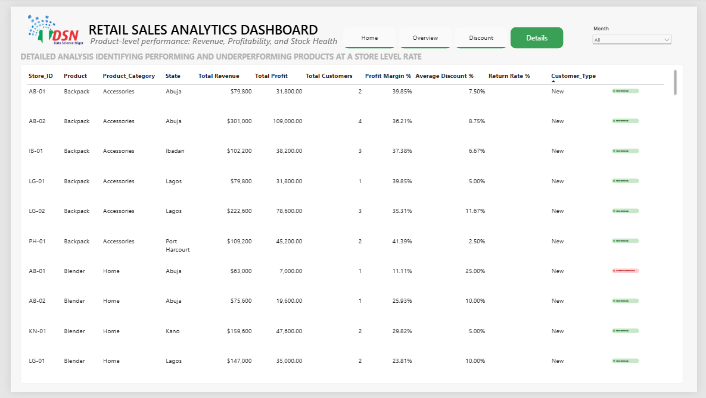

# Retail Performance Market Intelligence Report

> **Power BI | Retail Sales Analytics | Data Quality Audit | Profitability | Discount Strategy | Market Intelligence**

.jpg)

A Power BI retail analytics project that audits a transactional sales dataset, corrects critical data-quality issues, and turns the cleaned data into a decision-ready market intelligence dashboard.

[](https://www.microsoft.com/power-platform/products/power-bi)
[](https://learn.microsoft.com/power-query/)
[](https://learn.microsoft.com/dax/)

---

## Table of Contents

- [Project Overview](#project-overview)
- [Objectives](#objectives)
- [Tools Used](#tools-used)
- [Dataset](#dataset)
- [Data Cleaning](#data-cleaning)
- [Data Preprocessing and Analysis](#data-preprocessing-and-analysis)
- [Dashboard](#dashboard)
- [Key Insights](#key-insights)
- [Recommendations](#recommendations)
- [Project Structure](#project-structure)
- [Conclusion](#conclusion)
- [Source Documentation](#source-documentation)

---

## Project Overview

This project documents a complete retail sales analytics workflow executed for Data Science Nigeria (DSN).

The starting point was a transactional retail dataset and an existing Power BI dashboard. An audit found data-quality problems that affected revenue, profit, transaction counts, and market rankings. The project therefore focused first on establishing a reliable dataset before interpreting business performance.

The workflow covered:

**Raw transactions → Data-quality audit → Power Query cleaning → Revenue and cost recalculation → Return handling → DAX measures → Power BI dashboard → Business insights and recommendations**

The original dashboard showed approximately **₦46.68 million in revenue and 420 transactions**. The audit showed that the underlying data needed substantial correction before the figures could safely be used for management decisions.

All project findings documented here are based on the cleaned analysis described in the source report.

---

## Objectives

The primary objective was to establish a **single source of truth for retail performance**.

The analysis focused on:

- Total Revenue excluding returns
- Total Profit excluding returns
- Profit Margin %
- Return Rate %
- Market profitability by state
- Category profitability
- Revenue and performance trends
- Discounting and its relationship with profit margin
- Channel return behaviour
- Product and store-level performance

---

## Tools Used

| Tool | Purpose |
|---|---|
| **Microsoft Power BI** | Data modelling, DAX measures and interactive dashboard development |
| **Power Query** | Data cleaning, transformation and preprocessing |
| **DAX** | Calculated columns, measures, KPI logic and dynamic formatting |
| **Microsoft Word** | Project/report documentation |

---

## Dataset

### Source

The source data is described in the project documentation as a **single Excel sheet containing retail transaction records for FY 2026 (January–August)**.

Each row represents one transaction line item and includes product, customer, store, channel, pricing, discount, cost and return information.

### Coverage

- **Period:** January–August 2026
- **States:** Lagos, Kano, Ibadan, Port Harcourt, Abuja
- **Product categories:** Electronics, Home, Accessories
- **Sales channels:** In-store, Online, WhatsApp
- **Initial records:** 432 rows
- **Records after duplicate removal:** 420 unique transactions

### Key Fields

| Field | Description |
|---|---|
| `Transaction_ID` | Unique transaction identifier used for duplicate detection |
| `Date` | Transaction date |
| `Store_ID` | Store identifier |
| `State` | State where the store is located |
| `Channel` | Sales channel |
| `Product` | Specific product |
| `Product_Category` | Product grouping |
| `Units` | Quantity sold |
| `Unit_Price_NGN` | Catalogue/list price per unit |
| `Discount_Pct` | Discount applied |
| `Cost_Per_Unit_NGN` | Cost per unit |
| `Revenue_Reported_NGN` | Originally reported revenue |
| `Return_Flag` | Whether the transaction was returned |
| `Customer_ID` | Customer identifier |
| `Customer_Type` | New or Returning customer |
| `Sales_Rep` | Sales representative |


---

## Data Cleaning

Data quality was treated as a business-critical part of the analysis because incorrect source values were capable of changing management conclusions.

### 1. Exact Duplicate Transactions

**Finding:** 12 rows were exact duplicates of earlier `Transaction_ID` records.

**Action:** All 12 duplicate rows were removed using Power Query's **Remove Duplicates** operation across the relevant transaction fields.

**Effect:** The dataset was reduced from **432 rows to 420 unique transactions**.

**Why it mattered:** Duplicates artificially inflated revenue, profit, transaction counts and return-rate calculations.

---

### 2. Inconsistent State and Product Category Labels

The same entities appeared under multiple text representations.

Examples included:

- `Lagos`
- `Lagos `
- `LAGOS`

Product category variations included:

- `Accessories`
- `Accessories `
- `accessories`
- `Accessory`

**Actions taken:**

- Applied **Trim**
- Applied **Capitalize Each Word**
- Standardised `Accessory` to `Accessories` using **Replace Values**

This ensured that the same market and category were grouped together correctly.

---

### 3. Incorrect Reported Revenue

The audit found **22 rows** where `Revenue_Reported_NGN` did not match the transaction-level revenue implied by units, price and discount.

The corrected calculation was:

`Actual Revenue = Units × Unit_Price_NGN × (1 − Discount_Pct)`

This recalculated revenue was used as the basis for the financial analysis.

---

### 4. Missing Costs

**Finding:** 31 rows contained missing `Cost_Per_Unit_NGN` values.

**Action:** Missing costs were filled using the **median cost for the corresponding product**.

The process described in the report was:

1. Group the data by Product.
2. Calculate the median cost per product.
3. Merge the product-level median back into the main table.
4. Use the filled cost to calculate total cost and profit.

This approach was selected because the median is less sensitive to outliers than the mean.

---

### 5. Derived Fields

The cleaned dataset introduced the following calculated fields:

- **Actual Revenue**
- **Cost_Per_Unit_Filled**
- **Total_Cost**
- **Profit**
- **Is_Return**

The calculations were:

`Total_Cost = Units × Cost_Per_Unit_Filled`

`Profit = Actual Revenue − Total_Cost`

`Is_Return = 1` when `Return_Flag = "Yes"`, otherwise `0`.

---

### Data Quality Impact

The project documentation identifies **duplicate rows and the incorrect reported revenue field** as the issues with the greatest impact.

Together, they overstated reported performance. The documented audit comparison was approximately **₦47.5M raw reported total versus approximately ₦42.0M cleaned revenue excluding returns**, and the market profitability rankings were reversed.

---

## Data Preprocessing and Analysis

### Return Treatment

Returns were handled differently depending on the analytical question.

For:

- Profitability
- Category rankings
- Market rankings
- Monthly performance trends

transactions with `Return_Flag = "Yes"` were excluded.

Returns were retained for **return-rate analysis**.

This distinction prevents returned transactions from distorting the measurement of successful sales performance.

### Core DAX Measures

The project documentation includes the following core measures:

```DAX
Total Revenue = SUM(Sales[Revenue])

Total Profit = SUM(Sales[Profit])

Profit Margin % =
DIVIDE([Total Profit], [Total Revenue])

Return Rate % =
DIVIDE(
    CALCULATE(
        COUNTROWS(Sales),
        Sales[Return_Flag] = "Yes"
    ),
    COUNTROWS(Sales)
)

Revenue (excl Returns) =
CALCULATE(
    [Total Revenue],
    Sales[Return_Flag] = "No"
)

Profit (excl Returns) =
CALCULATE(
    [Total Profit],
    Sales[Return_Flag] = "No"
)
```

The report also documents dynamic month-over-month KPI text and conditional formatting logic for profit, margin, state, product, sales representative, channel, category and monthly revenue visuals.

See [DAX_Measures.md](DAX_Measures.md) for the documented calculation logic.

### Date Table

A dedicated Date table was created and marked as the model's date table.

It includes:

- Date
- Year
- Month Number
- Month
- Month Short
- Quarter
- Quarter Number
- Year-Month
- Week Number
- Day
- Day Name
- Day Short
- Day of Week
- Is Weekend

---

## Dashboard

The documented Power BI dashboard contains four described views:

### 1. Home Page

The home page presents headline KPIs and month-over-month indicators. The project documentation describes the initial headline figures as approximately **₦46.68M revenue and 420 transactions**.


### 2. Overview Page

The overview combines:

- Total Revenue
- Profit
- Profit Margin
- Return Rate
- Transactions

with breakdowns by:

- State
- Product
- Category
- Sales representative
- Channel

The documentation notes that several rankings changed after the data was cleaned.


### 3. Discount Analysis Page

The discount analysis examines:

- Average discount
- Discounted transaction share
- The relationship between discount depth and profit margin

The documented analysis identifies a negative relationship between discount depth and profit margin.


### 4. Details / Store-Level Product Performance

This view provides product-level profitability and identifies performing and underperforming product/store combinations.



> **Dashboard screenshots:** The source Medium article contains the original dashboard screenshots. This repository keeps the documentation grounded in those published visuals rather than fabricating replacement dashboard screenshots.

---

## Key Insights

### 1. Geographic Concentration

**Lagos** generated the highest revenue and profit in the corrected analysis. **Kano and Ibadan** were identified as secondary markets, while **Abuja** was the weakest market.

### 2. Volume vs. Margin

The analysis identified a trade-off between volume and margin:

- **Electronics** was the volume driver.
- **Accessories** was the margin driver.

This means performance should be assessed using both sales volume and profitability rather than revenue alone.

### 3. Discounting and Profitability

The analysis found a negative relationship between discount depth and profit margin. The documented conclusion is that broad, deep discounting can reduce profitability.

### 4. Channel Risk

**In-store** was identified as the channel with the lowest return rate.

The **WhatsApp and Online** channels recorded significantly higher return rates, highlighting the need to investigate issues such as product descriptions, customer expectations and fulfilment.

### 5. Seasonality

Sales were strongest in the first half of the year, particularly **January, April and May**, and weaker in **August**.

### 6. Returns

Returns represented **8.6% of transactions** and approximately **10% of value** in the documented analysis.

Because returns materially affect reported performance, they were excluded from profitability and ranking metrics while being retained for return-rate analysis.

---

## Recommendations

The recommendations below follow the documented project findings:

1. **Prioritise investment in proven profitable markets.** Allocate inventory, marketing and operational resources with stronger emphasis on Lagos and, secondarily, Kano and Ibadan.

2. **Adopt a data-driven discount policy.** Replace broad discounting with targeted promotions designed to protect profit margin.

3. **Investigate high-return digital channels.** Conduct a deeper review of WhatsApp and Online transactions to identify potential causes such as product descriptions, quality-control issues and fulfilment problems.

4. **Protect Accessories margin while scaling Electronics volume.** Treat the two categories differently because the analysis identifies different roles for them in the portfolio.

---

## Project Structure

```text
Retail-Performance-Market-Intelligence/
│
├── README.md
├── DAX_Measures.md
│
├── Images/
│   ├── 01_project_workflow.svg
│   ├── 02_data_quality_audit.svg
│   └── 03_dashboard_pages.svg
│
└── PowerBI/
    └── README.md
```

The `Images` directory contains lightweight SVG illustrations of the documented analytical process. They are designed to render directly on GitHub without external image dependencies.

The `PowerBI` directory documents the report-file handoff. The original binary PBIX is not reproduced from the article because the source documentation does not expose the underlying PBIX file.

---

## Conclusion

This project demonstrates that reliable business intelligence begins with reliable data.

The central lesson from the analysis was not simply the identification of the strongest market or most profitable category. The more important analytical step was establishing whether the numbers could be trusted in the first place.

By removing duplicates, standardising categorical values, recalculating revenue, completing missing costs, defining return treatment and applying DAX-based measures, the project converted a flawed transactional dataset into a more reliable basis for market and profitability analysis.

The resulting dashboard supports management questions around **where to invest, how to manage discounts, where returns require attention, and how volume and margin should be balanced**.

---

## Source Documentation

The complete project narrative, including the dataset description, cleaning decisions, DAX logic, dashboard descriptions, insights and recommendations, is documented in the original Medium article:

**[Retail Performance Market Intelligence Report — Adeyemi Adenuga](https://medium.com/@adeyemi.da/retail-performance-market-intelligence-report-9df73aa21a3b)**

